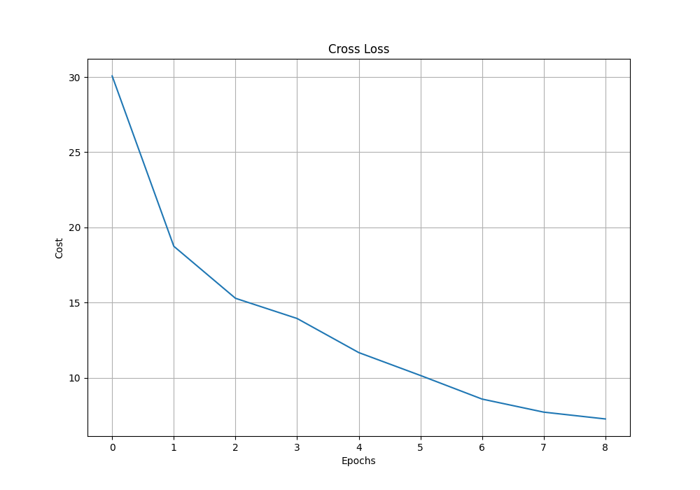

# README

## 1. 分类任务

- `sex` 性别
- `age` 年龄
- `race`种族
- `face` 表情

## 2. 分类模型

- `CNN` 卷积神经网络

## 3. 网络结构

|  网络结构  |      参数设定      |
| :--------: | :----------------: |
|   输入层   |   128 x 128 x 1    |
|  卷积层一  |   (3, 3, 1, 16)    |
| 池化后大小 |    64 x 64 x 16    |
|  卷积层二  |   (3, 3, 16, 32)   |
| 池化后大小 |    32 x 32 x 32    |
|  卷积层三  |   (3, 3, 32, 64)   |
| 池化后大小 |    16 x 16 x 64    |
|  全连接一  |    16384 x 512     |
|  全连接二  |     512 x 128      |
|   输出层   | 128 x number_label |

## 4. 代码说明

- `convert_img.m`: 将 `rawdata` 文件夹中的无扩展名文件转换为 `*.jpg` 图像并保存在 `dataset/jpgdata`中
- `image_outliers.py`: 检测 `dataset/jpgdata`中异常的图像（像素过于集中，图像过亮或过暗），并将异常结果保存在`dataset/outliers_too_bright.txt` 和 `dataset/outliers_too_dark.txt` 中
- `process_label.py`: 生成合法的图像的路径和分类标签
  - `sex (female: 0, male: 1)`
  - `age (child: 0, teen: 1, adult: 2, senior: 3)`
  - `race (white: 0, asian: 1, black: 2)`
  - `face (smiling: 0, serious: 1)`
- `main_sex_age_race_face.py`: 模型训练，模型测试，模型性能分析，模型预测
  - 选择分类标签: `choose = 3  # 性别:0, 年龄:1, 种族:2, 表情:3`

## 5. 代码运行

- `./main_sex_age_race_face.py`

## 6. 模型性能

### 6.1 sex

- 训练集表现

|  |  |
| ------------------------------------------------------------ | ------------------------------------------------------------ |

- 测试集表现

### 6.2 age

- 训练集表现

|  |  |
| ------------------------------------------------------ | ------------------------------------------------------------ |

- 测试集表现

### 6.3 race

- 训练集表现

|  |  |
| ------------------------------------------------------- | ------------------------------------------------------------ |

- 测试集表现

### 6.4 face

- 训练集表现

|  |  |
| ------------------------------------------------------- | ------------------------------------------------------------ |

- 测试集表现

## 7. Contact

- Mr. Lu, 1309002649@qq.com
