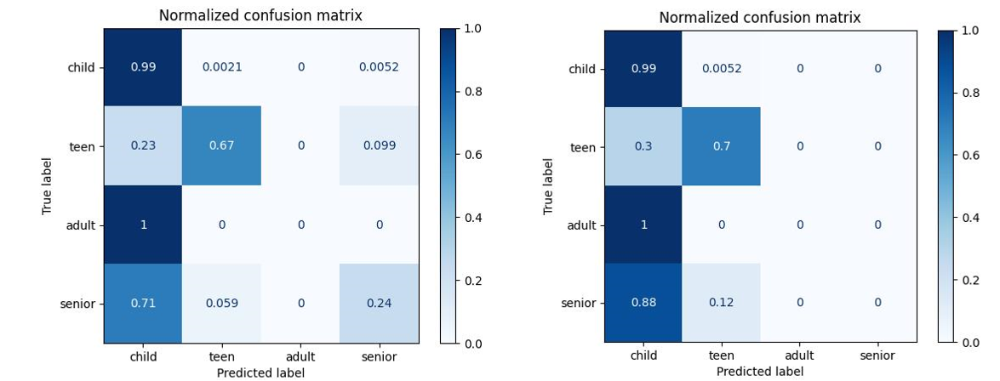
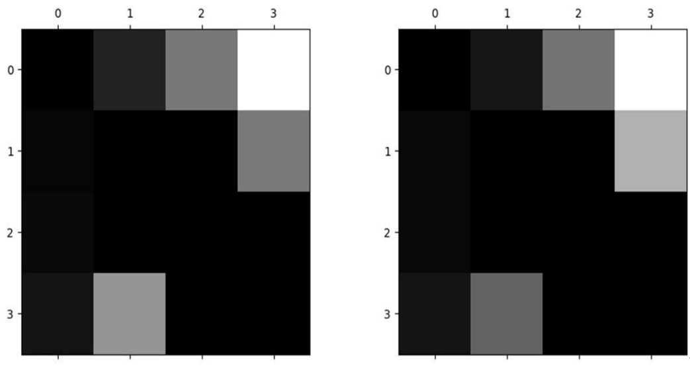
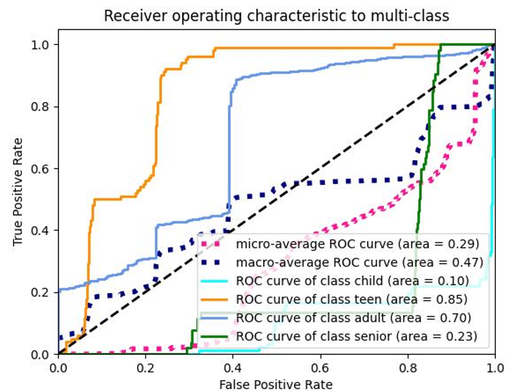
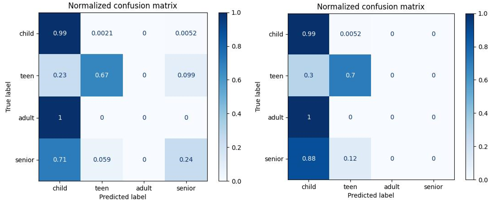
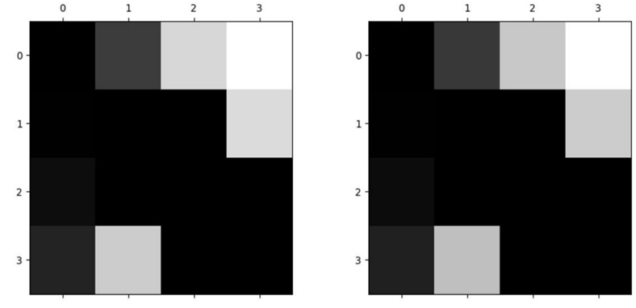
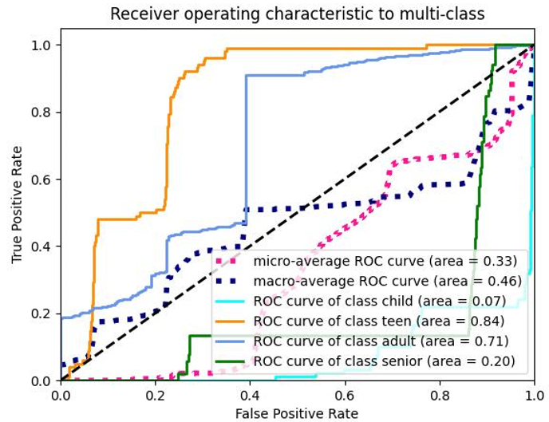

# 模式识别 - 人脸项目- SVM年龄分类

分配任务：使用SVM经典分类算法对人脸数据集的年龄模板进行分类，建立一套完整的年龄分类系统，并对最终结果进行分析。

## 1.安装python依赖

相关库：

```python
numpy==1.21.6
pandas==1.3.5
matplotlib==3.5.3
opencv-python==4.5.5.64
scikit-image==0.19.3
scikit-learn==1.1.2
scipy==1.10.1
```

安装依赖：

```python
pip install -r requirements.txt
```

## 2.准备数据

1. 在项目根目录下创建`data`父目录，包含`data/raw_data`和`data/raw_label`两个子目录；
2. 将人脸数据集中的图片二进制文件拷贝到`data/raw_data`中，并将faceDR、faceDS标签文件拷贝到`data/raw_label`中；
3. 在项目根目录下创建image父目录；
4. 修改`file_path.py`中的文件夹路径。

## 3.运行

```python
python scripts/faceIO.py
python scripts/Z_hog_pca_svm.py
```

## 4.结果

​	终端输出最终的分类信息，包含预测得分、耗时、分类报告、混淆矩阵和犯错矩阵等；

​	打开`data/image`可得混淆矩阵、犯错矩阵可视化结果与和ROC曲线。

### 4.1HOG-SVM

表1 Classification Report (HOG-SVM)

| **class/metric**     | **precision** | **recall** | **f1-score** | **support** |
| -------------------- | ------------- | ---------- | ------------ | ----------- |
| adult  （OVO)        | 0.86          | 0.99       | 0.92         | 945         |
| child  （OVO)        | 0.89          | 0.66       | 0.76         | 94          |
| teen  （OVO)         | 0.87          | 0.84       | 0.88         | 98          |
| senior  （OVO)       | 0.62          | 0.69       | 0.64         | 50          |
| weighted avg  （OVO) | 0.91          | 0.92       | 0.92         | 1187        |
| adult  (OVR)         | 0.96          | 0.96       | 0.96         | 945         |
| child  (OVR)         | 0.86          | 0.71       | 0.78         | 94          |
| teen  (OVR)          | 0.64          | 0.74       | 0.65         | 98          |
| senior  (OVR)        | 0.78          | 0.76       | 0.78         | 50          |
| weighted avg  (OVR)  | 0.91          | 0.87       | 0.92         | 1187        |

 

表2 Confusion Matrix (HOG-SVM)

| **class**     | **adult** | **child** | **teen** | **senior** |
| ------------- | --------- | --------- | -------- | ---------- |
| adult  (OVO)  | 901       | 2         | 2        | 8          |
| child  (OVO)  | 13        | 78        | 0        | 13         |
| teen  (OVO)   | 16        | 0         | 48       | 0          |
| senior  (OVO) | 15        | 14        | 0        | 77         |
| adult  (OVR)  | 910       | 12        | 6        | 5          |
| child  (OVR)  | 12        | 69        | 0        | 11         |
| teen  (OVR)   | 10        | 1         | 44       | 0          |
| senior  (OVR) | 13        | 12        | 0        | 82         |

 

表3 Error Matrix (HOG-SVM)

| **class**     | **adult** | **child** | **teen** | **senior** |
| ------------- | --------- | --------- | -------- | ---------- |
| adult  (OVO)  | 0         | 0.033     | 0.115    | 0.245      |
| child  (OVO)  | 0.006     | 0         | 0        | 0.118      |
| teen  (OVO)   | 0.010     | 0.001     | 0        | 0          |
| senior  (OVO) | 0.020     | 0.122     | 0        | 0          |
| adult  (OVR)  | 0         | 0.011     | 0.121    | 0.195      |
| child  (OVR)  | 0.001     | 0.013     | 0        | 0.144      |
| teen  (OVR)   | 0.012     | 0         | 0        | 0.121      |
| senior  (OVR) | 0.013     | 0.089     | 0        | 0          |

​                                                           

​                                                                                  图1 混淆矩阵(左图ovo，右图ovr)



​                                                                                  图2 犯错矩阵(左图ovo，右图ovr)



​                                                                                 			 图3 ROC曲线

### 4.2HOG-PCA-SVM

表4 Classification Report (HOG-PCA-SVM)

| **class/metric**    | **precision** | **recall** | **f1-score** | **support** |
| ------------------- | ------------- | ---------- | ------------ | ----------- |
| adult  (OVO)        | 0.97          | 0.98       | 0.97         | 945         |
| child  (OVO)        | 0.86          | 0.86       | 0.86         | 94          |
| teen  (OVO)         | 0.88          | 0.87       | 0.87         | 98          |
| senior  (OVO)       | 0.74          | 0.73       | 0.73         | 50          |
| weighted avg        | 0.94          | 0.94       | 0.94         | 1187        |
| adult  (OVR)        | 0.97          | 0.97       | 0.97         | 945         |
| child  (OVR)        | 0.86          | 0.86       | 0.86         | 94          |
| teen  (OVR)         | 0.88          | 0.87       | 0.87         | 98          |
| senior  (OVR)       | 0.73          | 0.73       | 0.73         | 50          |
| weighted avg  (OVR) | 0.94          | 0.94       | 0.94         | 1187        |


表5 Confusion Matrix (HOG-PCA-SVM)

| **class**     | **adult** | **child** | **teen** | **senior** |
| ------------- | --------- | --------- | -------- | ---------- |
| adult  (OVO)  | 925       | 5         | 5        | 10         |
| child  (OVO)  | 2         | 81        | 0        | 2          |
| teen  (OVO)   | 3         | 0         | 45       | 8          |
| senior  (OVO) | 15        | 8         | 0        | 78         |
| adult  (OVR)  | 931       | 4         | 4        | 11         |
| child  (OVR)  | 2         | 80        | 0        | 8          |
| teen  (OVR)   | 7         | 0         | 46       | 0          |
| senior  (OVR) | 5         | 10        | 0        | 79         |


表6 Error Matrix (HOG-PCA-SVM)

| class         | adult | child | teen  | Senior |
| ------------- | ----- | ----- | ----- | ------ |
| adult  (OVO)  | 0.001 | 0.021 | 0.113 | 0.112  |
| child  (OVO)  | 0.004 | 0     | 0     | 0      |
| teen  (OVO)   | 0.005 | 0     | 0     | 0.012  |
| senior  (OVO) | 0.181 | 0.120 | 0     | 0      |
| adult  (OVR)  | 0     | 0.012 | 0.141 | 0.121  |
| child  (OVR)  | 0.005 | 0     | 0     | 0.111  |
| teen  (OVR)   | 0.001 | 0.001 | 0     | 0.041  |
| senior  (OVR) | 0.120 | 0.131 | 0     | 0      |

​                                                           

​                                                                                  图4 混淆矩阵(左图ovo，右图ovr)



​                                                                                  图5 犯错矩阵(左图ovo，右图ovr)



​                                                                                 			 图6 ROC曲线


